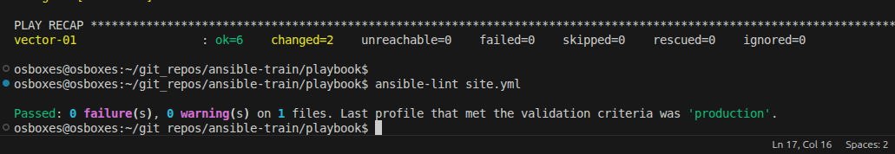
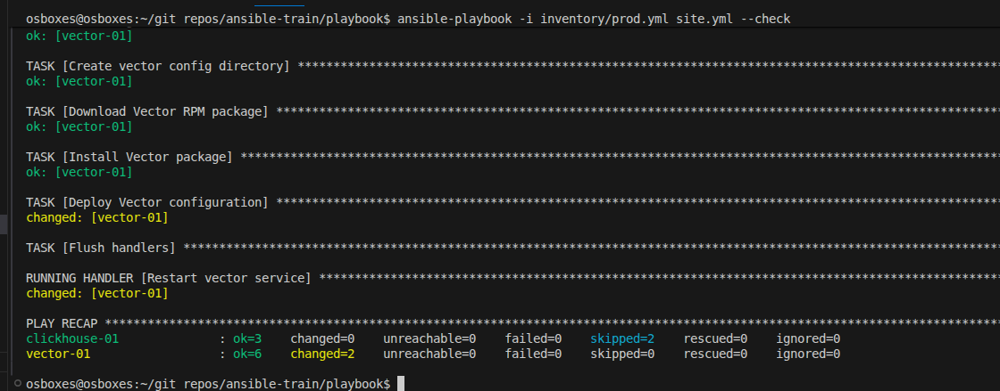

# Ansible Playbook для установки ClickHouse и Vector

Ansible playbook для автоматической установки и настройки ClickHouse (система управления базами данных) и Vector (сборщик и маршрутизатор логов) на удаленных хостах.

## Версии и ветки

Текущая версия playbook поддерживает:
- **ClickHouse** версии 22.3.12.19
- **Vector** версии 0.38.0

## Установка ClickHouse с Vector

Данный Ansible playbook обеспечивает:

- Установку ClickHouse (клиент, сервер, общие библиотеки)
- Настройка базы данных и таблиц для хранения логов
- Установка и настройка Vector для сбора и обработки логов
- Поддержка различных Linux дистрибутивов (CentOS, RHEL, Amazon Linux)
- Использование DNF пакетного менеджера
- Автоматический перезапуск сервисов при изменении конфигурации

### Предварительные требования

- **Ansible 2.9+**
- **Python 3.6+** на управляющих хостах
- **DNF** пакетный менеджер на целевых хостах (CentOS 8+, RHEL 8+, Fedora)

## Конфигурация

Для изменения значений по умолчанию обратитесь к следующим файлам конфигурации:

- `group_vars/clickhouse/clickhouse.yml` - (ClickHouse версия, пакеты)
- `group_vars/vector/vars.yml` - (Vector версия, пути, URL для скачивания)
- `vars/common.yml` - Название бд и таблицы Сlickhouse 
- `inventory/prod.yml` - Инвентарь хостов (IP адреса, пользователи SSH)

Измените значения в этих файлах для настройки параметров установки под ваши требования.

## Установка

```
# Установка с использованием production инвентаря
ansible-playbook -i inventory/prod.yml site.yml

# Запуск с использованием конкретных тегов
ansible-playbook -i inventory/prod.yml site.yml --tags clickhouse
ansible-playbook -i inventory/prod.yml site.yml --tags vector
```

## Теги

Playbook поддерживает следующие теги для выборочного выполнения задач:

| Тег | Группа хостов | Описание |
|-----|---------------|----------|
| `clickhouse` | clickhouse | Установка и настройка ClickHouse (скачивание пакетов, установка, создание БД и таблицы) |
| `vector` | vector | Установка и настройка Vector (создание директории, скачивание пакета, установка, деплой конфигурации, запуск сервиса) |


## Скриншоты выполнения команд

Запускаем линтер



Запускаем с флагом --check



Запускаем с флагом --diff. Меняется только timestamp в остальном playbook идемпотентен

