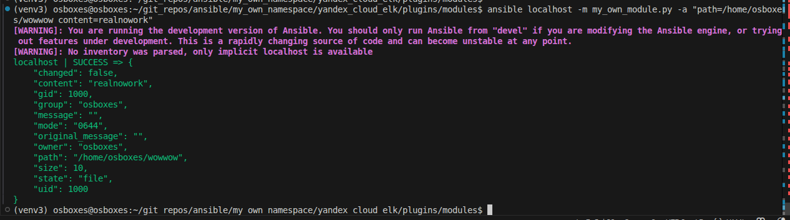
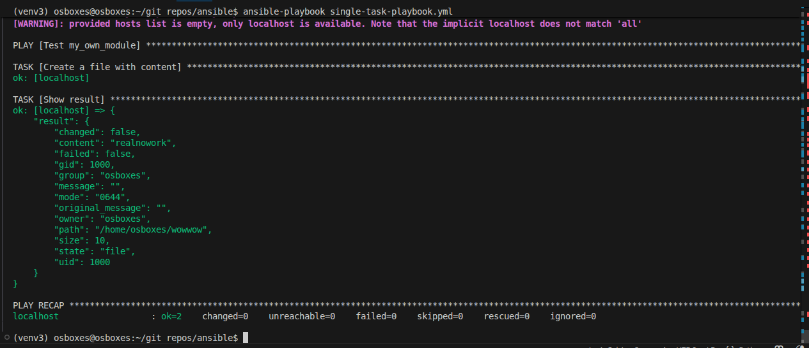
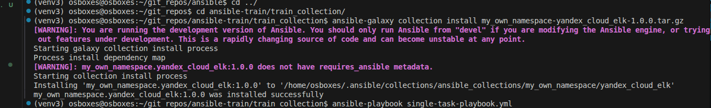
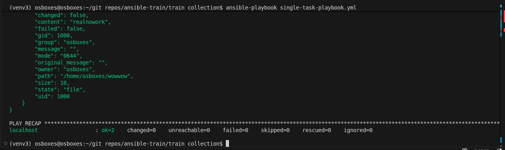

Шаг 4. Проверяем модуль на исполнение локально

Шаг 6. ПЗапускаем playbook с модулем

Шаг 6. ПЗапускаем playbook с модулем ещё раз (идемпотентность)

Шаг 15. Установил коллекцию из архива

Шаг 16. Запустил playbook с использованием модуля, который берется из коллекции

